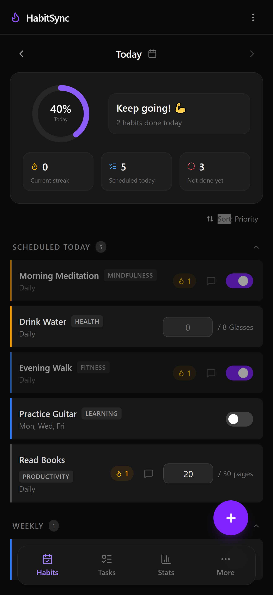
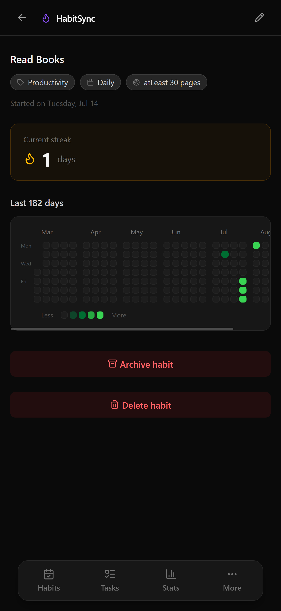
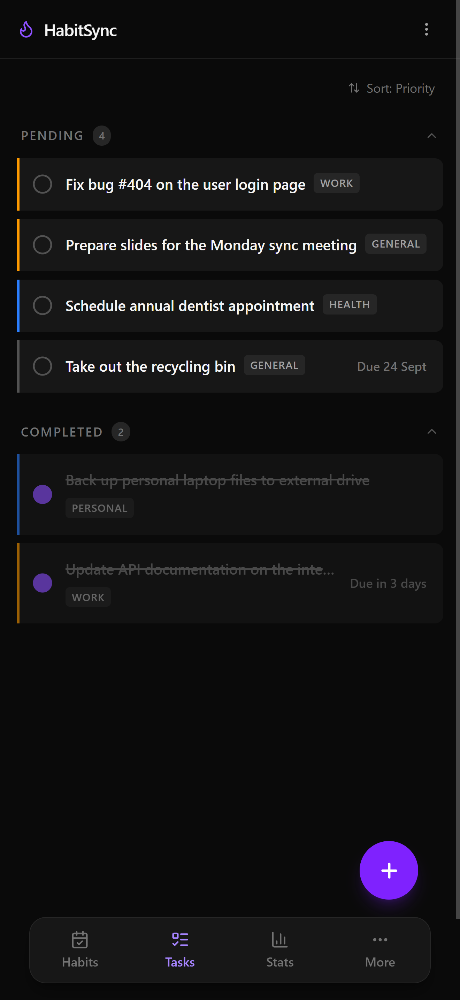
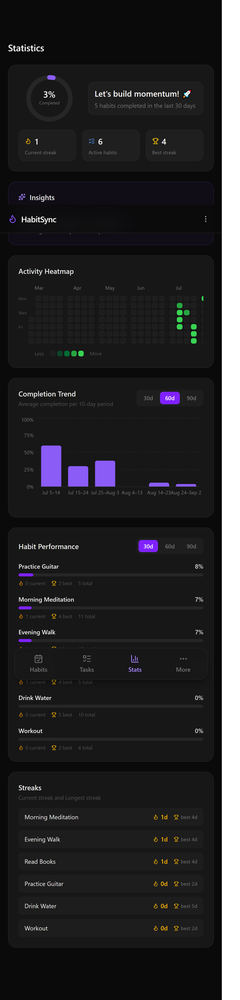

# HabitSync

A full-stack app for managing daily habits and tasks. I built it because most habit trackers I tried were either too simple (just a checkbox) or way too complicated (streaks, badges, social feeds, the works). I wanted something in between, minimal but flexible enough to handle daily, weekly, and monthly habits without forcing everything into the same box.

**Live demo:** [habitsyncweb.vercel.app](https://habitsyncweb.vercel.app)
**Demo login:** `demo@habitsync.app` / `demo123456`

_(Backend is on Render's free tier so it can take 20-30 seconds to wake up if it's been idle. Just give it a moment on first load.)_

---

## Screenshots






## Features

- Habits (daily, weekly, monthly, or flexible) and one-off tasks, side by side in one dashboard
- Boolean or measurable tracking, with streaks that respect your actual schedule and give partial credit instead of resetting on one rough day
- A stats page with a completion percentage, a 6-month activity heatmap, trend charts, and a few auto-generated insights
- Priority, notes, optional start/end dates, and archiving, the small things that make daily use less annoying
- Fully responsive, works fine on a phone

---

## Stack

**Frontend:** Next.js (App Router, but used purely for routing, everything is client-rendered), React Query, Zustand, React Hook Form, Radix UI, Recharts, Tailwind CSS

**Backend:** Node, Express, MongoDB with Mongoose, JWT auth in HttpOnly cookies and Cloudinary for cloud storage.

**Hosted on:** Vercel (frontend), Render (backend), MongoDB Atlas (database)

For the reasoning behind these choices and some of the trickier problems I ran into, see [ARCHITECTURE.md](./ARCHITECTURE.md).

---

## Running it locally

You'll need Node 18+, a MongoDB instance (local or Atlas works), and a Cloudinary account if you want avatar uploads to work.

**Backend**

```bash
cd backend
npm install
```

Create a `.env` file:

```
PORT=8000
MONGODB_URI=your-mongodb-uri
ACCESS_TOKEN_SECRET=whatever-you-want
ACCESS_TOKEN_EXPIRY=7d
REFRESH_TOKEN_SECRET=whatever-you-want
REFRESH_TOKEN_EXPIRY=30d
CORS_ORIGIN=http://localhost:3000
CLOUDINARY_CLOUD_NAME=your-cloud-name
CLOUDINARY_API_KEY=your-api-key
CLOUDINARY_API_SECRET=your-api-secret
```

```bash
npm run dev
```

**Frontend**

```bash
cd frontend
npm install
```

Create `.env.local`:

```
NEXT_PUBLIC_API_URL=http://localhost:8000/api/v1
```

```bash
npm run dev
```

Then open `http://localhost:3000`.

---

## What's next

A few things I want to add when I get time: an export/report feature, longest-streak tracking, and maybe letting tasks repeat weekly for people who want something between a task and a full habit.

---

## Copyright

Copyright (c) [2026] [Mohammad Mostafa Kawsar Rakib]

All rights reserved.
